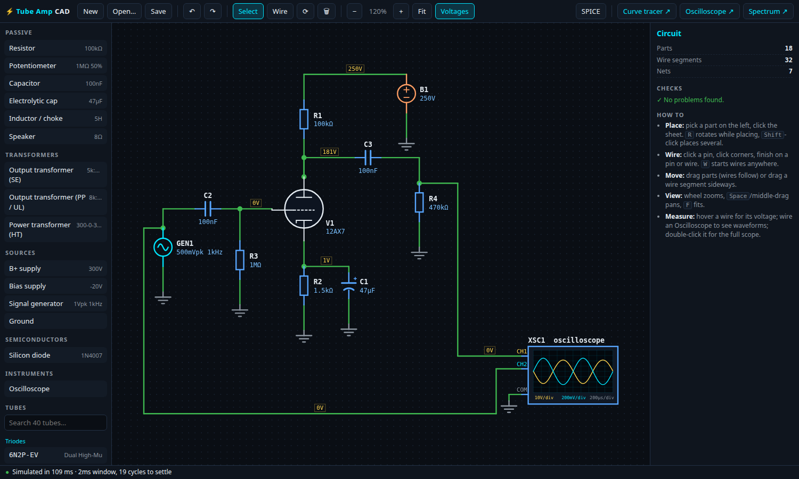
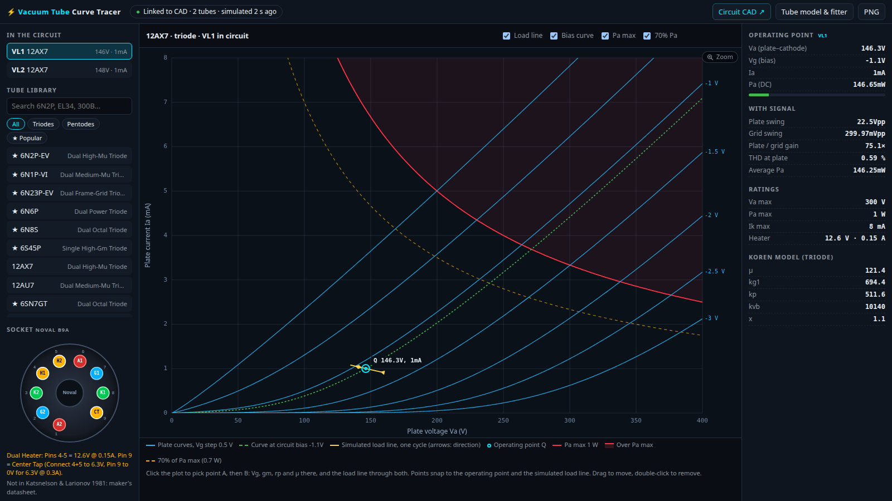
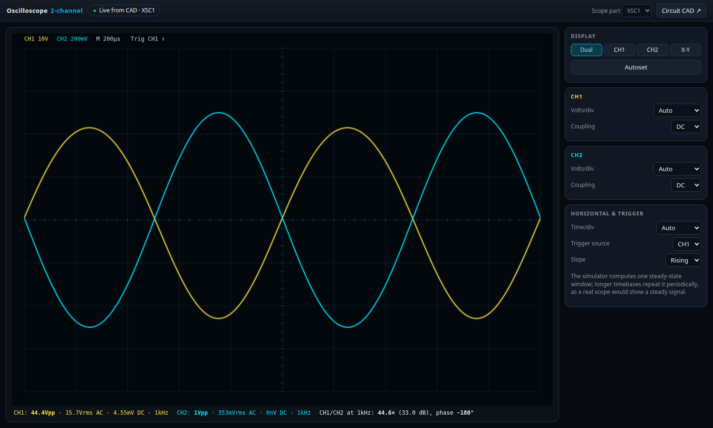

# Tube Amp CAD

Design and simulate vacuum-tube amplifiers in the browser. Draw a schematic,
and a circuit simulator computes the operating points and waveforms; a curve
tracer, oscilloscope and spectrum analyzer show the result like bench
instruments would.

**Live:** [kothf.github.io/tube-amp-cad](https://kothf.github.io/tube-amp-cad/) ·
also on [aerocat.tech/tools](https://aerocat.tech/tools/)



No install, no account, no server: everything runs on your machine, and your
circuit is saved in the browser.

## What it does

- **Schematic editor** — place parts from the palette, wire them, drag parts or
  wire segments, zoom and pan. Every net shows its DC voltage; hover a wire to
  measure it. Save/open as JSON or export a SPICE netlist.
- **Real simulation** — not a lookup table. A nodal solver runs your circuit
  through DC and transient analysis, including power supplies with rectifier
  tubes, chokes and output transformers, until it reaches steady state.
- **Curve tracer** — select a tube in the schematic and see its plate curves
  with the simulated load line, operating point, dissipation, gain and THD.
- **Oscilloscope & spectrum analyzer** — drop a scope part on the schematic and
  open it full-window, or view harmonic distortion on the analyzer.
- **40 tubes** — Western and Soviet small-signal triodes (12AX7, 6N2P, 6SN7…),
  power tubes (EL84, EL34, 6V6, KT88, 300B, 845, GU-50…) and rectifiers
  (5U4G, GZ34, 5Ts3S…), with pinouts and ratings.

| Curve tracer | Oscilloscope |
|---|---|
|  |  |

## How the simulator works

`sim-engine.js` is a small SPICE-style engine (no dependencies, ~500 lines):

- Modified nodal analysis; Newton-Raphson with source stepping for the DC
  operating point; backward-Euler transient.
- Triodes use [Koren's](https://www.normankoren.com/Audio/Tubemodspice_article.html)
  published equation, unmodified, so their parameters are interchangeable
  with Koren-style SPICE models. Pentodes keep Koren's space-charge term but
  divide the current between plate and screen with a separate knee and slope,
  sending what the plate loses in the knee to the screen, so full-power
  behaviour matches the datasheets. Grid conduction and screen current are
  included, and the exported SPICE models use exactly the same equations.
  Rectifiers are vacuum diodes (Child–Langmuir, perveance from datasheet drops).
- Transformers are coupled inductors with a leakage factor; inductors and
  windings carry their current as an unknown, so a shorted winding is
  reported instead of crashing the solver.
- Supplies with large capacitors take seconds of circuit time to settle. The
  engine detects the slowly decaying response and extrapolates it to periodic
  steady state (minimal polynomial extrapolation), typically in tens of
  milliseconds of compute.

It runs in a Web Worker, so the editor stays responsive while it solves.

## Accuracy

The test suite checks the engine against independent results: a resistor
divider and RC/RL filters against closed-form answers, a 12AX7 stage against a
separate solve of the Koren equation and its small-signal gain, an output
transformer against its turns ratio, and a choke-input supply against an RK4
integration of the same circuit (agreement within 0.02 %).

Every amplifier tube is fitted to, and tested against, its published
datasheet operating points: plate current, and where the datasheet gives them,
transconductance, plate resistance and screen current. Sources are listed per
tube in [`tests/datasheets.mjs`](tests/datasheets.mjs). Fitted currents are
within a few percent of the datasheets; a triode-connected pentode is fitted to
the same tube's pentode model, so both modes agree. Full simulations of the
EL84 and 6V6GT datasheet test circuits (cathode-biased) land on the published
current and dissipation.

**Reference circuits.** `npm run test:reference` builds classic circuits in the
editor and measures them through the oscilloscope and spectrum analyzer
windows, the way a user would, against published or textbook results
(75 comparisons). Highlights:

| Circuit | Measured | Reference |
|---|---|---|
| 12AX7, 370 V / 100 kΩ / 1.6 kΩ bypassed: plate, cathode | 246 V, 1.94 V | 250 V, 1.92 V (RCA 12AX7A point) |
| same stage: gain bypassed / unbypassed | 61.9× / 30.8× | 61.5× / 30.9× (µ·Ra/(Ra+rp…), RCA µ, rp) |
| 12AU7 cathode follower, Rk 810 Ω: cathode, gain | 8.53 V, 0.622× | 8.5 V, 0.618× |
| RC low-pass at its corner: gain, phase | 0.703×, −45.0° | 0.707×, −45.0° |
| 2A3 single-ended, 250 V / −45 V / 2.5 kΩ | 3.8 W, 3.2 % THD, 60.2 mA | 3.5 W, 5 %, 60 mA (RCA) |
| EL84 single-ended (Philips conditions) | 5.9 W, 11 % THD; 53.9 / 55.9 mA | 5.7 W, 10 %; 53.5 / 60.3 mA (idle / full drive) |
| 6V6GT single-ended, 250 V (RCA) | 4.5 W, 9.6 % THD; 50.1 / 57.0 mA | 4.5 W, 8 %; 49.5 / 54 mA |
| 6V6GT single-ended, 315 V / 225 V (RCA) | 5.3 W, 12.0 % THD | 5.5 W, 12 % |
| 6L6GC single-ended (RCA) | 6.4 W, 10.6 % THD, 76.9 mA | 6.5 W, 10 %, 77 mA |
| Full-wave rectifier, 300-0-300 V, 100 µF, 3 kΩ: DC, ripple | 417 V, 12.6 Vpp @ 100 Hz | 416 V, ≈13.9 Vpp (I/2fC) |
| Square / triangle into the analyzer: H3…H9 | within 0.07 dB | Fourier series |

The scope's probes load the circuit like real ones (10 MΩ with the default
10× probes, 1 MΩ at 1×), so readings on high-impedance nodes behave as on a
bench.

Limits worth knowing: a model is exact only near the points it was fitted to,
and production tubes vary ±20 % or more; the 6P45S has only a pulse-current
specification to fit; and the knee of pentodes without published full-power
data (EL34, KT88, 6P1P, GU-50, 6P45S) is the median of the EL84, 6V6GT and
6L6GC fits rather than their own.

## Run it locally

Any static web server works; the simulator needs `http://` (not `file://`)
for its Web Worker:

```sh
python3 -m http.server 8080   # then open http://localhost:8080/
```

## Development

```sh
npm ci
npx playwright install chromium
npm test            # engine accuracy tests + browser end-to-end tests
npm run package     # dist/tube-amp-cad/ and a versioned .tar.gz
```

Pages load their scripts with `?v=dev`; packaging stamps the release version
into every asset URL so browsers and CDNs never mix two versions.

### Releasing

1. Add the changes under a new version in `CHANGELOG.md`.
2. Bump `version` in `package.json`.
3. `git tag vX.Y.Z && git push origin main vX.Y.Z`

The Release workflow tests the source and the packaged build, publishes a
GitHub release with `tube-amp-cad-X.Y.Z.tar.gz` and its SHA-256 (the archive is
byte-for-byte reproducible), and deploys it to GitHub Pages.
[aerocat.tech](https://aerocat.tech) embeds released versions only, pinned by
version and checksum; a scheduled workflow there proposes upgrades as pull
requests.

## Contributing

Read [docs/ARCHITECTURE.md](docs/ARCHITECTURE.md) first: it explains how the
files fit together and the rules that keep the engine, exports and viewers
consistent.

## License

[MIT](LICENSE)
