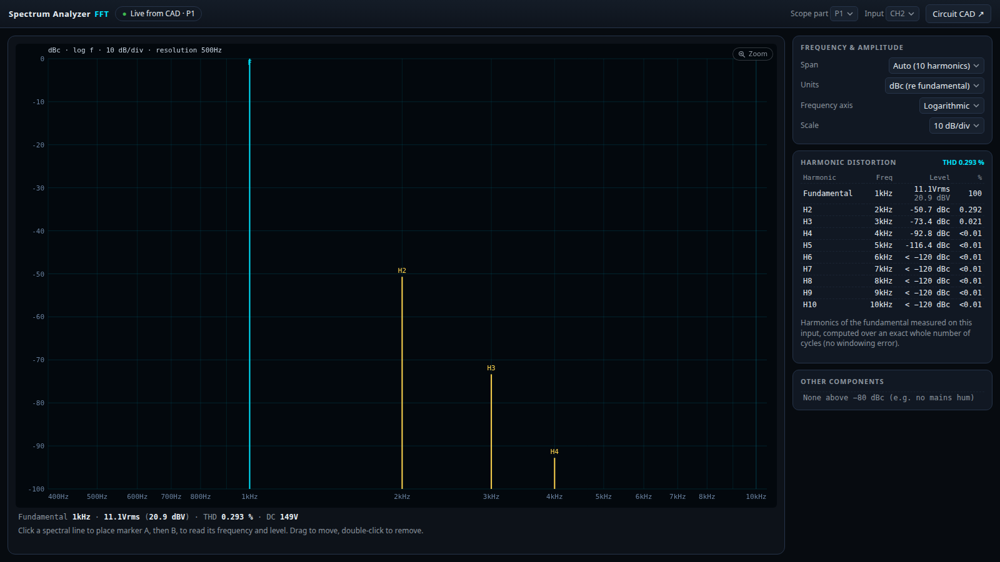
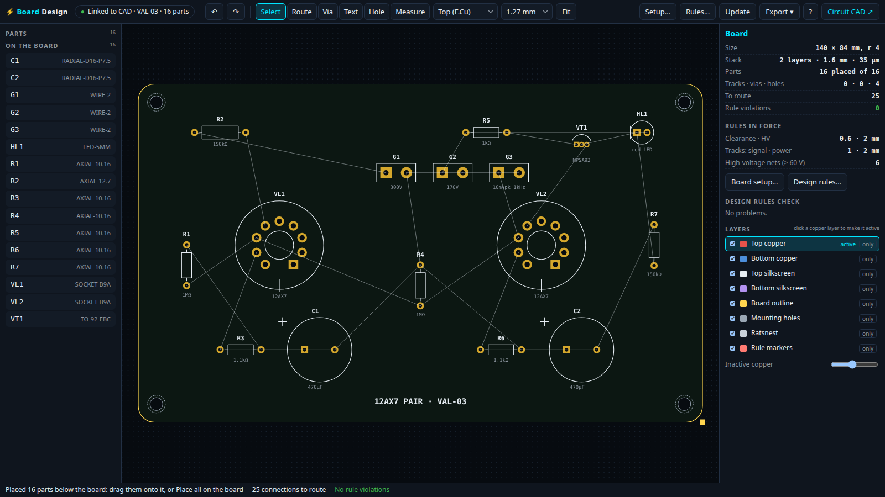

# Tube Amp CAD

Design and simulate vacuum-tube amplifiers in the browser. You draw a
schematic, and a circuit simulator computes the operating points and
waveforms. A curve tracer, an oscilloscope and a spectrum analyzer show the
result as bench instruments would.

**Live:** [kothf.github.io/tube-amp-cad](https://kothf.github.io/tube-amp-cad/) ·
also on [aerocat.tech/tools](https://aerocat.tech/tools/)


There's nothing to install, no account and no server. Everything runs on
your machine, and the browser saves your circuit.

**Browsers:** tested in Chrome, Edge and other Chromium browsers (Brave,
Vivaldi, Opera) and in Safari (the whole test suite also runs in WebKit).
Firefox is not tested.

## Contents

- [The schematic editor](#the-schematic-editor)
- [Parts](#parts)
- [Measuring on the schematic](#measuring-on-the-schematic)
- [Drawings, documents and exports](#drawings-documents-and-exports)
- [Instruments](#instruments)
- [Board Design](#board-design)
- [Keyboard shortcuts](#keyboard-shortcuts)
- [How the simulator works](#how-the-simulator-works)
- [Accuracy](#accuracy)
- [Run it locally](#run-it-locally) · [Development](#development) · [Contributing](#contributing)

## The schematic editor

- **Placing parts.** Pick a part in the palette on the left and click the
  sheet; Shift-click places several. The search box at the top of the palette
  finds:
  - parts by name;
  - part numbers: 2N3904, IRF540, 1N4742A, 125ESE, 373BX …;
  - tubes: EL84, 6N2P, 300B …;
  - values: `47k` offers a 47 kΩ resistor or potentiometer, `100n` a
    100 nF capacitor, `47u` an electrolytic, `5H` a choke, `300V` a supply.

  Enter picks the first match. Click a palette group's title to fold it; the
  browser remembers which groups are open.
- **Wiring.** Click a pin, click the corners, and finish on a pin or a wire.
  <kbd>W</kbd> starts a wire anywhere. A wire ending on another wire joins it
  with a junction dot; plain crossings stay unconnected.
- **Editing.**
  - Drag parts and their wires follow; drag a wire segment sideways to move
    it.
  - <kbd>R</kbd> rotates, <kbd>M</kbd> mirrors left to right, <kbd>D</kbd>
    duplicates, <kbd>Del</kbd> deletes, with undo and redo.
  - Mirror works for every part that can rotate, including any part added to
    the library later. So a complementary pair, or a tube taking its grid from
    the right, can be drawn without crossing wires.
- **Inspector (right).** Every value of the selected part: resistance
  ("4.7k"), tube type, transformer model and tap, generator level in Vpk, Vrms
  or dBV. With a simulation result it adds:
  - the part's operating point: Va, Vg, Ia, Pa and gain for a tube; Vce, Ic,
    hFE and dissipation for a transistor;
  - checks against the part's ratings.

  With nothing selected it shows a power summary instead: output into the
  speakers, and tube, transistor and resistor dissipation.
- **Live or on demand.** The circuit re-simulates after every edit, or turn
  *Live* off and press *▶ Simulate* (<kbd>Ctrl</kbd>+<kbd>Enter</kbd>).
  - Either way, slow power supplies are run until they have fully settled.
  - The button shows the run's progress ("■ Stop · 48 %"); press it again to
    stop a long run.
- **Checks.** Unconnected pins, shorted parts, a missing ground, sheet
  connectors without a partner, and parts beyond their ratings: tube
  dissipation, resistor power, output-transformer DC current, transistor Vce
  and dissipation, zener power.
- **Layout.**
  - Drag the edge of the palette, the inspector or the BOM to resize it, and
    double-click the edge to reset it. The same goes for the side panels of
    the instrument windows.
  - <kbd>F1</kbd> or the **?** button opens the help with every shortcut.
  - Shortcuts go by the key's position, so they work with a Russian or any
    other keyboard layout.
- **Files.**
  - File → Open / Save / Save as (JSON). In Chrome and Edge, Save writes back
    to the opened file after asking; in Safari and other browsers it
    downloads the file.
  - The circuit is also autosaved in the browser.

## Parts

| Group | Parts |
|---|---|
| Passive | resistor (with power rating, marked in the symbol per ГОСТ 2.728), potentiometer (lin/log), capacitor, electrolytic, choke with DCR, changeover switch (ganged sections), speaker |
| Transformers | generic single-ended and push-pull/UL output transformers and a generic power transformer; the seven **Hammond 125SE** output transformers and 25 **Hammond 300-series** power transformers, modelled from the maker's drawings (winding resistances, inductance, excitation, no-load voltages, ratings) |
| Tubes | **99 tubes**: the Soviet receiving tubes from Katsnelson & Larionov, «Отечественные приёмно-усилительные лампы и их зарубежные аналоги» (1981), including triodes and double triodes (6С2С, 6С33С, 6Н1П…6Н33Б), voltage and output pentodes (6Ж1П, 6Ж32П, 6П1П, 6П3С, 6П14П, 6П27С…), triode-pentodes as two sections (6Ф1П, 6Ф3П, 6Ф4П, 6Ф5П) and kenotrons (5Ц3С, 5Ц4С, 6Ц4П…), with the handbook's ratings and pinouts; plus Western tubes from their makers' datasheets (12AX7, EL84, EL34, KT88, 300B, 845, GZ34…). Pentodes can be used triode-connected. |
| Semiconductors | silicon diodes (1N4007, UF4007, 1N4148); zener diodes 1N4733A … 1N5388B (5.1–200 V, 1 W and 5 W); LEDs (red, yellow, green, blue) for cathode bias; **NPN** 2N2222A, 2N3904, BC107, BC547B, BD139, MPSA42, MJE340 and **PNP** 2N2907A, 2N3906, BC177, BC557B, BD140, MPSA92, MJE350; **N-MOSFETs** 2N7000, BS170, IRF510, IRF540, IRF820, IRF840 and the depletion DN2540 and LND150 for current sources; **P-MOSFETs** BS250, IRF9540, IRF9610, IRF9640 |
| Sources | DC supply (B+, bias), AC mains (feeds a power transformer), signal generator (sine, square, triangle; Vpk, Vrms or dBV), ground, sheet connector |
| Instruments | two-channel oscilloscope (its screen live on the schematic, full window on double-click) |
| Document | IEC 61082 drawing frame with title block, text note |

## Measuring on the schematic

- **Voltage and current on every wire.**
  - Each net carries a sticker with its DC voltage, and each run of wire one
    with its DC current and direction ("↓1.38mA"). In a mains-fed circuit
    both are averaged over the settled window, as a meter reads them.
  - Currents come from every part's terminal currents and are passed along
    the wiring, so a junction shows how the current splits. On the 12AX7
    above, 1.02 mA from the plate resistor splits into 1 mA anode and 15 µA
    into the scope probe.
  - The stickers are placed where they cover no text, no symbol and no other
    sticker. If there is no room at all, a sticker is left out.
  - Hovering a wire shows its voltage, AC swing and current in the status
    bar. The *Voltages* and *Currents* buttons turn the stickers on and off.
- **Scope screens on the schematic.** An oscilloscope part shows its two
  channels live; double-click it for the full instrument.
- **Power-on transient.** The oscilloscope can show the first seconds after
  switch-on: capacitors start empty and every source switches on at t = 0.

## Drawings, documents and exports

- **IEC drawings.**
  - Symbols follow IEC 60617.
  - Designations use the classic letter codes (R1, C1, L1, T1, VL1.1, VD1,
    VT1, HL1, SA1, BA1, G1, P1, as in ГОСТ 2.710), with automatic
    renumbering in reading order.
  - Tube pin numbers sit beside each terminal; the section follows the
    designation (VL1.1 / VL1.2).
  - Labels are placed per IEC 61082-1: left of vertical symbols, above
    horizontal ones.
- **Sheets.**
  - *File → New* starts a sheet with an ISO 5457 frame, a reference grid and
    an ISO 7200 title block (A4 to A1, landscape or portrait). *File → Add
    sheet* adds further sheets.
  - Sheet connectors with the same signal name join their wires across
    sheets and show where their partners are (sheet / grid zone).
  - Frames are locked against accidental moves; unlock one in its inspector.
  - A circuit with several sheets opens on sheet 1. The Sheet list, or <kbd>F</kbd>
    pressed twice, shows them all.
- **PDF and PNG.**
  - *Save as PDF* writes every sheet as a vector page.
  - *Export sheet…* saves the sheet in use, each sheet as its own file, or
    all sheets in one PDF.
  - PNG at 150, 300 or 600 dpi, black on white like the PDF or in the
    editor's colours.
- **Bill of materials.** The *BOM* button (<kbd>B</kbd>) opens the parts list
  under the schematic:
  - equal parts on one line with designator ranges (R1-R4); both sections of
    a dual tube count once; a tube-socket line per base;
  - ratings (resistor wattage, transistor Vceo / Ic / Ptot / package,
    transformer ratings);
  - the simulated worst case: dissipation, capacitor peak voltage, LED
    current;
  - a part number you can type in, saved with the circuit.

  Click a line to select its parts; selecting a part scrolls to its line.
  Export as TXT, CSV, XLSX or PDF.
- **SPICE.** *Export SPICE netlist* writes an LTspice netlist: tubes as
  behavioural sources with the same equations the simulator uses, transistors
  as Q and M elements with their `.model` lines.

## Instruments

| Curve tracer | Oscilloscope |
|---|---|
|  |  |



- **Curve tracer.** Select a tube in the schematic to see its plate curves
  with:
  - the operating point;
  - the curve at the circuit's bias;
  - the simulated load line: the last whole cycle of the signal, an ellipse
    when the load is reactive, with arrows for the direction;
  - Pa max and 70 % Pa;
  - dissipation, swing, gain and THD at the plate.

  It also has the tube library with socket pinouts, the Koren parameters, an
  LTspice `.subckt` export, and a fitter for your own measured curves.
- **Oscilloscope.**
  - Two channels, DC or AC coupled, with 10× (10 MΩ) or 1× (1 MΩ) probes
    that load the circuit like real ones.
  - Auto volts/div with offset; the timebase locks to the measured frequency;
    edge trigger; X-Y mode.
  - Scale labels on every axis: time below, CH1's volts on the left, CH2's on
    the right. They sit on round values and follow zoom and position.
  - Readouts in Vpp, Vrms, dBV and DC, with the CH1/CH2 gain and phase.
  - Channels with no probe wired are greyed out.
  - *Power-on* shows the switch-on transient with an overview strip of the
    whole record.
- **Spectrum analyzer.**
  - The FFT is computed over a whole number of cycles, so there is no
    windowing error.
  - A harmonic table up to H10 with THD.
  - Other components (hum, intermodulation) in dBc and dBV.
  - Levels in dBc or dBV.
  - A linear or **logarithmic** frequency axis: on the log axis, 50/100 Hz
    ripple and the audio harmonics read in one view.
- **Markers.** Click any graph to place markers A and B:
  - time and voltage with ΔT and ΔV on the scope;
  - frequency and level on the analyzer;
  - Vg, dissipation, gm, rp and µ at a point of the plate curves, with the
    load line through two points.
- **Mouse zoom.** On every graph:
  - the wheel zooms at the pointer (time/div on the scope, the frequency axis
    on the analyzer, both axes on the curves);
  - Ctrl+wheel zooms the vertical axis;
  - right-drag or Shift+drag moves the view.

The windows talk to each other in the browser. The CAD broadcasts each result,
and the instruments only listen, so you can arrange them on several monitors.

## Board Design



The **Board ↗** button opens the PCB layout of the circuit. The board takes its
parts and connections from the schematic, and the CAD saves the layout inside
the circuit file, so one file holds both.

- **Footprints** chosen for each part, through-hole as valve amplifiers are
  built:
  - resistors by power rating (10.16 mm lead spacing at ¼ W up to 40.64 mm at
    10 W), film boxes by value, electrolytics by size;
  - transistors in TO-92, TO-18, TO-126 and TO-220 with each part's own pin
    order (pinouts that differ between makers are flagged);
  - real tube sockets (B9A noval, B7G, Magnoval, octal, UX4), drawn from the
    component side; both sections of a dual tube share one socket, each on
    its own pins;
  - wire pads for chassis-mounted parts: transformers, chokes, speakers,
    supplies, input jacks.

  Every part's footprint can be changed in the inspector.
- **Placement.** New parts wait in a row below the board. Drag them on, or
  *Place all on the board* for a first arrangement. <kbd>R</kbd> rotates,
  <kbd>M</kbd> moves a part to the bottom side. When the schematic changes, a
  banner offers the update; placed parts keep their spot.
- **Routing.** <kbd>X</kbd>: click a pad, click the corners (45° bends), end on
  a pad of the same net. <kbd>V</kbd> changes layer with a via. The track width
  comes from the net's class. The ratsnest shows what is still to route.
- **Tools:** Select, Route, Via, Text (silkscreen or copper), Mounting hole,
  Measure. The board's corner handle resizes it.
- **Design rules** (*Rules…*):
  - clearances, with a separate high-voltage clearance for nets above a
    threshold voltage;
  - the board-edge clearance;
  - signal and power track widths and the minimum track;
  - via drill and pad, minimum drill, minimum annular ring;
  - which checks run.

  **Net classes** sort every net into Signal, Power or HV: automatically, from
  its simulated DC voltage (above 60 V by default is HV) and GND being Power,
  or as you set it per net.
- **Design-rule check**, live:
  - clearance between nets and to mounting holes;
  - shorts;
  - copper or parts over or near the board edge;
  - annular rings, drills, minimum and class track widths;
  - parts not placed yet;
  - pinouts to check.

  Click an entry to go to it.
- **Board setup** (*Setup…*): outline size, corner radius, mounting holes (one
  in each corner, M2.5–M4, chosen inset), board thickness and copper weight.
- **Layers:** top and bottom copper, both silkscreens, outline, mounting holes,
  ratsnest and rule markers. Each can be shown or hidden, or shown alone
  (*only*). Click a copper layer to make it active, and dim the inactive
  copper with the slider.
- **Export:** the board drawing as SVG at 1:1 mm, the top copper, the bottom
  copper mirrored (for toner transfer), and the board file as JSON.

## Keyboard shortcuts

| Key | Action |
|---|---|
| <kbd>R</kbd> / <kbd>M</kbd> | rotate / mirror the selection (also while placing) |
| <kbd>D</kbd> or <kbd>Ctrl</kbd>+<kbd>D</kbd> | duplicate |
| <kbd>Del</kbd> | delete |
| <kbd>W</kbd> / <kbd>V</kbd> / <kbd>Esc</kbd> | wire tool / select tool / cancel, clear the selection |
| <kbd>F</kbd> | fit the sheet in use; again: all sheets |
| <kbd>B</kbd> | bill of materials |
| <kbd>+</kbd> / <kbd>−</kbd>, wheel | zoom; <kbd>Space</kbd>-drag or middle-drag pans |
| <kbd>Ctrl</kbd>+<kbd>Z</kbd> / <kbd>Ctrl</kbd>+<kbd>Y</kbd> | undo / redo |
| <kbd>Ctrl</kbd>+<kbd>C</kbd> / <kbd>V</kbd> / <kbd>A</kbd> | copy / paste / select all |
| <kbd>Ctrl</kbd>+<kbd>S</kbd> / <kbd>Ctrl</kbd>+<kbd>Shift</kbd>+<kbd>S</kbd> / <kbd>Ctrl</kbd>+<kbd>O</kbd> | save / save as / open |
| <kbd>Ctrl</kbd>+<kbd>Enter</kbd> | simulate until settled |
| <kbd>F1</kbd> or <kbd>?</kbd> | help |

In the Board window: <kbd>X</kbd> route, <kbd>V</kbd> via / switch the active layer, <kbd>Shift</kbd>+<kbd>V</kbd> via tool, <kbd>T</kbd> text, <kbd>H</kbd> mounting hole, <kbd>D</kbd> measure, <kbd>S</kbd> select, <kbd>R</kbd> rotate, <kbd>M</kbd> other side, <kbd>F</kbd> fit, <kbd>Backspace</kbd> takes back the last corner while routing.

## How the simulator works

`sim-engine.js` is a small SPICE-style engine with no dependencies:

- **Solver.** Modified nodal analysis. Newton-Raphson with gmin and source
  stepping for the DC operating point, then a backward-Euler transient.
- **Triodes** use [Koren's](https://www.normankoren.com/Audio/Tubemodspice_article.html)
  published equation unmodified, so their parameters are interchangeable with
  Koren-style SPICE models.
- **Pentodes** keep Koren's space-charge term but divide the current between
  plate and screen with a separate knee and slope. What the plate loses in
  the knee goes to the screen, so full-power behaviour matches the
  datasheets.
- Grid conduction and screen current are included, and the exported SPICE
  models use exactly the same equations.
- **Rectifier tubes** are vacuum diodes (Child–Langmuir, with perveance from
  datasheet drops).
- **Transistors** use the SPICE Gummel-Poon model (IS, BF, BR, VAF, IKF)
  with junction capacitances. The 2N2222A, 2N3904, 2N3906 and 2N2907A use
  their published SPICE parameters; the others are set to their datasheet's
  typical gain.
- **MOSFETs** are square-law (SPICE level 1), with the overdrive smoothed
  over 50 mV around threshold, plus a body diode and gate capacitances. The
  threshold is the middle of the datasheet range, and Kp comes from the
  datasheet's forward transconductance (Kp = gfs²/2Id).
- **Diodes, zeners and LEDs** are exponential junctions. A zener's breakdown
  is a second junction set to its datasheet voltage at the test current and
  its dynamic resistance.
- Junction voltages are limited each iteration (SPICE `pnjlim`), and an
  iteration in which one was limited never counts as converged.
- **Transformers** are coupled inductors with a leakage factor. Inductors and
  windings carry their current as an unknown, so a shorted winding is
  reported instead of crashing the solver.
- **Steady state.** Supplies with large capacitors take seconds of circuit
  time to settle. The engine detects the slowly decaying response and
  extrapolates it to periodic steady state (minimal polynomial
  extrapolation), typically in tens of milliseconds of compute.
- **Currents.** Every element reports its terminal currents (averaged over
  the window with a rectified supply). The wire currents on the schematic
  are summed from these.

It runs in a Web Worker, so the editor stays responsive while it solves.

## Accuracy

The test suite checks the engine against independent results:

- a resistor divider and RC/RL filters against closed-form answers;
- a 12AX7 stage against a separate solve of the Koren equation and its
  small-signal gain;
- an output transformer against its turns ratio;
- a choke-input supply against an RK4 integration of the same circuit
  (agreement within 0.02 %);
- a 2N3904 stage against a nested bisection of the Gummel-Poon equations, a
  MOSFET follower against the square law;
- Kirchhoff's current law at every node, also for currents averaged over a
  rectifier's window.

Every amplifier tube is fitted to, and tested against, its published
datasheet operating points: plate current and, where the datasheet gives
them, transconductance, plate resistance and screen current. Sources are
listed per tube in [`tests/datasheets.mjs`](tests/datasheets.mjs).

- Fitted currents are within a few percent of the datasheets.
- A triode-connected pentode is fitted to the same tube's pentode model, so
  both modes agree.
- Full simulations of the EL84 and 6V6GT datasheet test circuits
  (cathode-biased) land on the published current and dissipation.

**Reference circuits.** `npm run test:reference` builds classic circuits in
the editor and measures them through the oscilloscope and spectrum analyzer
windows, the way a user would, against published or textbook results (76
comparisons). Highlights:

| Circuit | Measured | Reference |
|---|---|---|
| 12AX7, 370 V / 100 kΩ / 1.6 kΩ bypassed: plate, cathode | 246 V, 1.94 V | 250 V, 1.92 V (RCA 12AX7A point) |
| same stage: gain bypassed / unbypassed | 61.9× / 30.8× | 61.5× / 30.9× (µ·Ra/(Ra+rp…), RCA µ, rp) |
| 12AU7 cathode follower, Rk 810 Ω: cathode, gain | 8.53 V, 0.622× | 8.5 V, 0.618× |
| RC low-pass at its corner: gain, phase | 0.703×, −45.0° | 0.707×, −45.0° |
| 2A3 single-ended, 250 V / −45 V / 2.5 kΩ | 3.8 W, 3.2 % THD, 60.2 mA | 3.5 W, 5 %, 60 mA (RCA) |
| EL84 single-ended (Philips conditions) | 5.9 W, 11 % THD; 53.9 / 55.9 mA | 5.7 W, 10 %; 53.5 / 60.3 mA (idle / full drive) |
| 6V6GT single-ended, 250 V (RCA) | 4.5 W, 9.6 % THD; 50.1 / 57.0 mA | 4.5 W, 8 %; 49.5 / 54 mA |
| 6V6GT single-ended, 315 V / 225 V (RCA) | 5.3 W, 12.0 % THD | 5.5 W, 12 % |
| 6L6GC single-ended (RCA) | 6.4 W, 10.6 % THD, 76.9 mA | 6.5 W, 10 %, 77 mA |
| Full-wave rectifier, 300-0-300 V, 100 µF, 3 kΩ: DC, ripple | 417 V, 12.6 Vpp @ 100 Hz | 416 V, ≈13.9 Vpp (I/2fC) |
| Square / triangle into the analyzer: H3…H9 | within 0.07 dB | Fourier series |

**Published transistor and hybrid circuits.** Five circuits from published
sources were drawn and simulated, two of them against bench measurements:

| Circuit (source) | Simulated | Published |
|---|---|---|
| 2N3904 common emitter, RE unbypassed (UW BEE 332 lab, measured with actual part values) | VE 0.710 V, VC 6.47 V, gain −4.89 | VE 0.7096 V, VC 6.54 V, gain −4.72 |
| same, RE bypassed by 10 µF, small signal | gain −121 | −114 (the lab's Multisim run); hand calculation ≈ −122 |
| 12AX7 with an MPSA92 current-source load from 170 V, against 150k from 300 V (TubeCAD) | gain 104 and 75 at 1 mA, 148 / 146 V plate | 100 and 70 at 1 mA, 150 V |
| IRF820 source follower on 300 V, gate at ~170 V (forum design replacing a 6C4) | 3.53 mA, 0.48 W | ~3.5 mA, ~0.46 W |
| 12AX7 RC stage per the GE datasheet table (300 V, 100k, 900 Ω bypassed) | 40.3 Vrms at 5 % THD; gain 60 | 40 Vrms at 5 % THD; gain 50 |
| 10 W complementary MOSFET amplifier (IRF540 / IRF9540, homemade-circuits.com) | 30 mA idle with the bias preset, gain 11.0, < 0.01 % THD to 4 W, 8.4 W at 1 % on an ideal 30 V supply | ~30 mA, gain ≈ 10, < 0.1 %, 6–7 W on a loaded 30 V supply |

**Limits worth knowing.**

- A model is exact only near the points it was fitted to, and production
  tubes vary ±20 % or more.
- The 12AX7's µ rises to about 106 at 150–170 V plate (it is fitted at
  250 V), so small-signal gains there come out 5–20 % above the
  textbook / GE figures.
- The 6P45S has only a pulse-current specification to fit.
- The knee of pentodes without published full-power data (EL34, KT88, 6P1P,
  GU-50, 6P45S) is the median of the EL84, 6V6GT and 6L6GC fits rather than
  their own.
- Transistor models leave out base resistance and thermal effects, so
  distortion in solid-state stages comes out optimistic.

## Run it locally

Any static web server works. The simulator needs `http://` (not `file://`)
for its Web Worker:

```sh
python3 -m http.server 8080   # then open http://localhost:8080/
```

`index.html` is the curve tracer and `circuit_sandbox.html` the CAD; each
opens the others.

## Development

```sh
npm ci
npx playwright install chromium
npm test            # engine accuracy tests, browser end-to-end tests, reference circuits
npm run package     # dist/tube-amp-cad/ and a versioned .tar.gz
```

- `npm run test:engine` runs the solver and model tests (Node, no browser).
- `npm run test:e2e` drives the real pages in headless Chromium: editing with
  mouse and keyboard, simulation, instruments, exports, BOM, panels and
  stickers.
- `npm run test:reference` runs the reference circuits above.
- `BROWSER=webkit npm run test:e2e` (and `test:reference`) runs the same
  suites in WebKit, Safari's engine, after `npx playwright install webkit`.

Pages load their scripts with `?v=dev`. Packaging stamps the release version
into every asset URL, so browsers and CDNs never mix two versions.

### Releasing

1. Add the changes under a new version in `CHANGELOG.md`.
2. Bump `version` in `package.json`.
3. `git tag vX.Y.Z && git push origin main vX.Y.Z`

The Release workflow tests the source and the packaged build, publishes a
GitHub release with `tube-amp-cad-X.Y.Z.tar.gz` and its SHA-256 (the archive
is byte-for-byte reproducible), and deploys it to GitHub Pages.
[aerocat.tech](https://aerocat.tech) embeds released versions only, pinned by
version and checksum; a scheduled workflow there proposes upgrades as pull
requests.

## Contributing

Read [docs/ARCHITECTURE.md](docs/ARCHITECTURE.md) first: it explains how the
files fit together and the rules that keep the engine, exports and viewers
consistent.

## License

[MIT](LICENSE)
